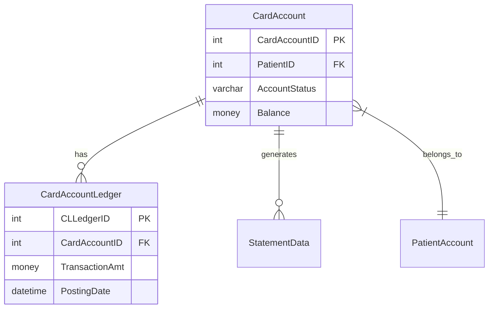

# Database Infrastructure Dashboard - Implementation Plan

## Overview

Create a visual dashboard to explore, compare, and document database schemas across environments (PROD, QA, Staging, DEV).

---

## Dashboard Features

### 1. Database Overview Tab

**Purpose:** High-level summary of all databases

```
┌─────────────────────────────────────────────────────────────────────┐
│  DATABASE INFRASTRUCTURE OVERVIEW                                    │
├─────────────────────────────────────────────────────────────────────┤
│                                                                      │
│  ┌──────────────┐  ┌──────────────┐  ┌──────────────┐               │
│  │ CarePayment  │  │    Core      │  │   Payments   │               │
│  │   PROD       │  │    PROD      │  │    PROD      │               │
│  │ 1,204 tables │  │  --- tables  │  │  --- tables  │               │
│  │ 56 schemas   │  │  -- schemas  │  │  -- schemas  │               │
│  └──────────────┘  └──────────────┘  └──────────────┘               │
│                                                                      │
│  Environment Comparison:  [PROD] [QA] [Staging] [DEV]               │
│                                                                      │
│  ┌─────────────────────────────────────────────────────────────┐   │
│  │ Schema Distribution (Pie Chart)    │ Tables by Size (Bar)   │   │
│  └─────────────────────────────────────────────────────────────┘   │
└─────────────────────────────────────────────────────────────────────┘
```

### 2. Schema Explorer Tab

**Purpose:** Browse and search database structure

```
┌─────────────────────────────────────────────────────────────────────┐
│  SCHEMA EXPLORER                           🔍 Search tables/columns │
├──────────────────┬──────────────────────────────────────────────────┤
│  Schemas         │  Tables in: CarePayment                          │
│  ────────────    │  ──────────────────────────────────────────────  │
│  > Accounting    │  ┌────────────────────────────────────────────┐  │
│  > CallCenter    │  │ CardAccountLedger          52 cols    PK   │  │
│  ▼ CarePayment   │  │ SitePatientAccount         48 cols    PK   │  │
│    > CardAcct... │  │ StatementData              36 cols    PK   │  │
│    > LogoConfig  │  │ LogoConfig                 52 cols         │  │
│    > Statement.. │  │ LogoTermLength             29 cols    PK   │  │
│  > ClientData    │  └────────────────────────────────────────────┘  │
│  > DataLoad      │                                                  │
│  > Epic          │  Table Details: CardAccountLedger                │
│  > FiServ        │  ┌────────────────────────────────────────────┐  │
│  > Report        │  │ Column          │ Type     │ Null │ PK/FK │  │
│                  │  │ CLLedgerID      │ int      │ NO   │ PK    │  │
│                  │  │ CardAccountID   │ int      │ NO   │ FK    │  │
│                  │  │ TransactionAmt  │ money    │ NO   │       │  │
│                  │  │ PostingDate     │ datetime │ NO   │       │  │
│                  │  └────────────────────────────────────────────┘  │
└──────────────────┴──────────────────────────────────────────────────┘
```

### 3. Visual ERD Tab

**Purpose:** Entity Relationship Diagram visualization

```
┌─────────────────────────────────────────────────────────────────────┐
│  ENTITY RELATIONSHIP DIAGRAM          Schema: [CarePayment ▼]       │
├─────────────────────────────────────────────────────────────────────┤
│                                                                      │
│    ┌─────────────────┐         ┌─────────────────┐                  │
│    │ CardAccount     │         │ PatientAccount  │                  │
│    ├─────────────────┤    1:N  ├─────────────────┤                  │
│    │ CardAccountID   │─────────│ PAAcctID        │                  │
│    │ PatientID       │         │ CardAccountID   │                  │
│    │ AccountStatus   │         │ Balance         │                  │
│    └────────┬────────┘         └─────────────────┘                  │
│             │                                                        │
│             │ 1:N                                                    │
│             ▼                                                        │
│    ┌─────────────────┐         ┌─────────────────┐                  │
│    │ CardAcctLedger  │         │ StatementData   │                  │
│    ├─────────────────┤         ├─────────────────┤                  │
│    │ CLLedgerID      │─────────│ StatementID     │                  │
│    │ CardAccountID   │         │ CardAccountID   │                  │
│    │ TransactionAmt  │         │ StatementDate   │                  │
│    └─────────────────┘         └─────────────────┘                  │
│                                                                      │
│  [Zoom +] [Zoom -] [Fit] [Export PNG] [Export SVG]                  │
└─────────────────────────────────────────────────────────────────────┘
```

### 4. Environment Comparison Tab

**Purpose:** Side-by-side PROD vs QA/Staging/DEV comparison

```
┌─────────────────────────────────────────────────────────────────────┐
│  ENVIRONMENT COMPARISON           [PROD ▼] vs [QA ▼]                │
├─────────────────────────────────────────────────────────────────────┤
│  Summary: 99.1% Match | 11 PROD-only | 2 QA-only | 6 col diffs      │
├─────────────────────────────────────────────────────────────────────┤
│                                                                      │
│  ┌─────────────────────────────────────────────────────────────┐   │
│  │ TABLES ONLY IN PROD (11)        TABLES ONLY IN QA (2)       │   │
│  │ ─────────────────────────       ────────────────────        │   │
│  │ ⚠ DataLoad.AccountInit...      ✚ OnFile.ExtendedTerms      │   │
│  │ ⚠ Withdraw.RequestArchive      ✚ OnFile.AcceptedStatus     │   │
│  │ ⚠ Withdraw.RequestException                                 │   │
│  └─────────────────────────────────────────────────────────────┘   │
│                                                                      │
│  ┌─────────────────────────────────────────────────────────────┐   │
│  │ COLUMN DIFFERENCES                                          │   │
│  │ Table                      │ PROD Only      │ QA Only       │   │
│  │ FiServ.CardAccount         │ GuarantorID    │ GuarantorId   │   │
│  │ CarePayment.SelfDirected.. │ -              │ SourceAppId   │   │
│  │ CarePayment.LogoConfig_..  │ -              │ ExtendedTerm..│   │
│  └─────────────────────────────────────────────────────────────┘   │
│                                                                      │
│  [Export Diff Report]  [Sync Recommendations]                        │
└─────────────────────────────────────────────────────────────────────┘
```

### 5. Integration Points Tab

**Purpose:** Visualize external system integrations

```
┌─────────────────────────────────────────────────────────────────────┐
│  INTEGRATION POINTS                                                  │
├─────────────────────────────────────────────────────────────────────┤
│                                                                      │
│  ┌──────────┐      ┌──────────────────┐      ┌──────────┐          │
│  │   Epic   │◄────►│   CarePayment    │◄────►│  FiServ  │          │
│  │ 11 tables│      │   Core Database  │      │ 67 tables│          │
│  │ Patient  │      │                  │      │ Payments │          │
│  │ Events   │      │    1,204 tables  │      │ Statements│         │
│  └──────────┘      └──────────────────┘      └──────────┘          │
│       ▲                    │                       ▲                │
│       │                    │                       │                │
│       ▼                    ▼                       ▼                │
│  ┌──────────┐      ┌──────────────────┐      ┌──────────┐          │
│  │ CallCenter│     │   DataLoad       │      │ Accounting│         │
│  │ 13 tables│      │   114 tables     │      │ 68 tables │         │
│  └──────────┘      └──────────────────┘      └──────────┘          │
│                                                                      │
│  Risk Assessment:                                                    │
│  🔴 Critical: Epic (PHI), FiServ (Payments)                         │
│  🟡 High: Accounting, DataLoad                                      │
│  🟢 Medium: CallCenter, Report                                      │
└─────────────────────────────────────────────────────────────────────┘
```

### 6. Data Dictionary Tab

**Purpose:** Searchable documentation of all tables/columns

```
┌─────────────────────────────────────────────────────────────────────┐
│  DATA DICTIONARY                    🔍 Search: patient              │
├─────────────────────────────────────────────────────────────────────┤
│                                                                      │
│  Found 47 matches for "patient"                                      │
│                                                                      │
│  ┌───────────────────────────────────────────────────────────────┐  │
│  │ Table                        │ Column            │ Type       │  │
│  │ CarePayment.SitePatientAcct  │ PAAcctID          │ int (PK)   │  │
│  │ CarePayment.SitePatientAcct  │ PatientName       │ varchar    │  │
│  │ CarePayment.SitePatientAcct  │ PatientSSN        │ char(9)    │  │
│  │ Epic.PatientInformation      │ PatientID         │ int (PK)   │  │
│  │ Epic.PatientAcceptance       │ PatientAcceptID   │ int (PK)   │  │
│  │ Accounting.PatientAcctRecall │ PARPatientAcctID  │ int        │  │
│  └───────────────────────────────────────────────────────────────┘  │
│                                                                      │
│  [Export to CSV]  [Export to Markdown]  [Generate Documentation]    │
└─────────────────────────────────────────────────────────────────────┘
```

---

## Technical Architecture

### Option A: Standalone Dashboard (Recommended)

```
qe-mcp-stack/
├── db-dashboard/                    # New dashboard
│   ├── index.html                   # Main dashboard
│   ├── styles.css                   # Styling
│   ├── app.js                       # Main application
│   ├── components/
│   │   ├── schemaExplorer.js        # Schema tree view
│   │   ├── tableDetails.js          # Table/column details
│   │   ├── erdDiagram.js            # ERD visualization
│   │   ├── envComparison.js         # Environment diff
│   │   └── integrationMap.js        # Integration diagram
│   └── lib/
│       ├── d3.min.js                # For visualizations
│       └── mermaid.min.js           # For ERD diagrams
├── schemas/                         # Schema JSON files
│   ├── CarePayment_PROD.json
│   ├── CarePayment_QA.json
│   └── ...
└── docker-compose.yml               # Add db-dashboard service
```

### Option B: Add to Existing Code Dashboard

Add new tabs to the existing code-dashboard for database exploration.

---

## Visualization Libraries

| Feature            | Library        | Why                      |
| ------------------ | -------------- | ------------------------ |
| ERD Diagrams       | **Mermaid.js** | Easy syntax, auto-layout |
| Interactive Graphs | **D3.js**      | Flexible, powerful       |
| Tree Views         | **Vanilla JS** | Lightweight, custom      |
| Charts             | **Chart.js**   | Simple pie/bar charts    |

---

## Implementation Phases

### Phase 1: Core Dashboard (MVP)

- [ ] Create db-dashboard structure
- [ ] Database overview with stats
- [ ] Schema/table browser
- [ ] Table detail view with columns
- [ ] Basic search functionality

### Phase 2: Visualizations

- [ ] ERD diagram generation (Mermaid.js)
- [ ] Schema relationship graph (D3.js)
- [ ] Integration points map
- [ ] Data type distribution charts

### Phase 3: Comparison Features

- [ ] PROD vs QA comparison view
- [ ] Diff highlighting
- [ ] Column-level comparison
- [ ] Export diff reports

### Phase 4: Advanced Features

- [ ] Data dictionary export
- [ ] Auto-generate documentation
- [ ] Impact analysis (which tables affected by schema)
- [ ] Historical schema tracking

---

## Data Flow

```
┌─────────────────┐     ┌─────────────────┐     ┌─────────────────┐
│  SQL Server     │────►│  Schema JSON    │────►│  DB Dashboard   │
│  (via SQLCMD)   │     │  Files          │     │  (Browser)      │
└─────────────────┘     └─────────────────┘     └─────────────────┘
       │                       │                        │
       │ Manual export         │ Static files           │ Client-side
       │ (one-time/periodic)   │ in /schemas/           │ rendering
       ▼                       ▼                        ▼
  Windows VM            qe-mcp-stack repo         User's browser
```

---

## Sample ERD Generation (Mermaid.js)



---

## Docker Integration

```yaml
# Add to docker-compose.yml
db-dashboard:
  image: nginx:alpine
  container_name: db-dashboard
  ports:
    - "8085:80"
  volumes:
    - ./db-dashboard:/usr/share/nginx/html:ro
    - ./schemas:/usr/share/nginx/html/schemas:ro
  networks:
    - qe-network
```

---

## Questions to Decide

1. **Standalone vs Integrated?**
   - New db-dashboard (cleaner separation)
   - Add to code-dashboard (fewer services)

2. **Static vs API-driven?**
   - Static JSON files (simpler, current approach)
   - MCP with live DB connection (more complex, real-time)

3. **ERD Scope?**
   - Per-schema ERDs (manageable)
   - Full database ERD (very complex with 1,200+ tables)
   - Selected tables only (user picks)

4. **Refresh Strategy?**
   - Manual re-export from VM
   - Scheduled job
   - On-demand button in dashboard
